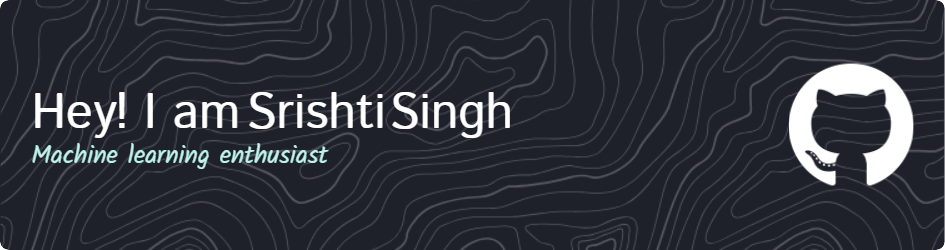

<h1 align="center">Hi 👋, I'm Srishti Singh</h1>
<h3 align="center">A passionate Machine Learning Engineer from India</h3>

- 🔭 I’m currently working on **Web Scraping**

- 🌱 Currently diving deeper into **Advanced Machine Learning**.
- 🎯 Goal: Build impactful tech that blends **intelligence** and **creativity**
- 📫 How to reach me **singhsrishti1934@gmail.com**

- 🎲 Fun fact: I can switch from debugging code to binge-watching thrillers in seconds!

<h3 align="left">Connect with me:</h3>

<h3 align="left">Languages and Tools:</h3>

                

